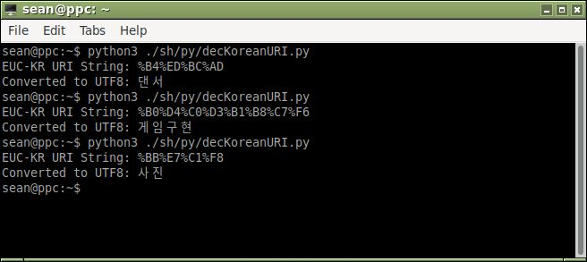

# Korean URI Decoder
A tool that takes a Korean URI string and converts it to a UTF8 URI then decodes
 to standard text. 
Note: `kr2utf.dict.xz` must be in the same folder as `decKoreanURI.py`.

__License__: GPLv3+

__Author__: [Sean Stafford](http://github.com/PyroSamurai)

__Example of use__: 

